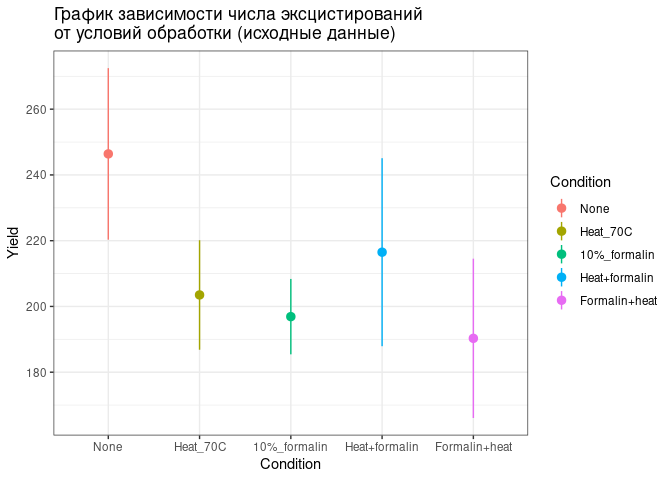
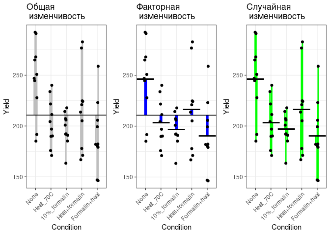
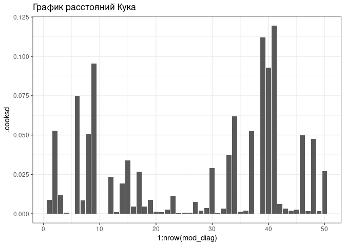
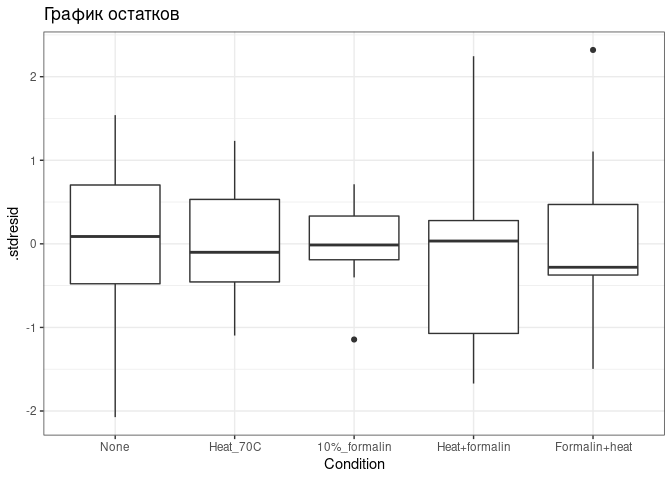
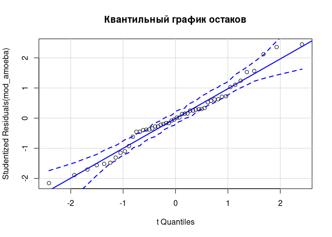
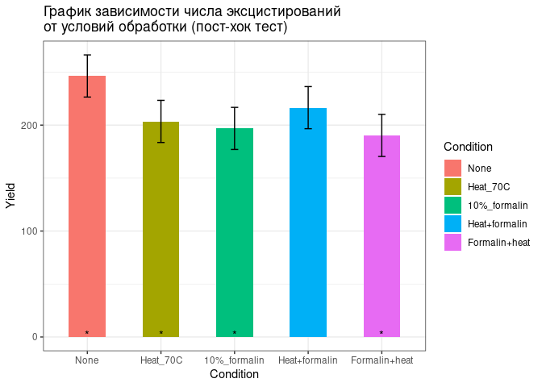

Линейные модели с дискретными предикторами
================
Лаврентий Данилов
14.11.2020

# Теория

Ранее мы разбирали линейные модели, включавшие в себя непрерывные
предикторы. На предыдущих лекциях мы коснулись теоретической части,
касающейся моделей, где наравне с непрерывными присутствует и дискретный
предиктор. В такой ситуации используется dummy-переменная, задача
которой “переключать” модель между уровнями группирующего фактора.

## Проблема множественных сравнений

Однако нередко возникает задача сравнить между собой несколько групп по
какому-то признаку. Мы уже умеем сравнивать между собой две группы с
помощью t-теста. Почему нельзя применить этот метод для сравнения
нескольких групп? Провести серию попарных сравнений…

Нельзя. И причина этого лежит в логике тестирования. Мы помним, что при
применении t-теста мы фиксируем вероятность ошибки 1 рода. Обычно это
0.05, то есть мы готовы ошибаться в 5% случаев при тестировании
гипотезы. Теперь представьте, что у вас несколько групп, как в наших
сегодняшних данных. Тогда при проведении m сравнений верхняя оценка
вероятности того, что хотя бы один из них будет неверным, равна …, что
достаточно велико уже при небольших m (например, при m=5 она равна..).

## Дисперсионный анализ

Есть несколько способов избежать завышения вероятности ошибки 1 рода.
Один из них - дисперсионный анализ. Другие способы (например, поправки
на множественные сравнения) см. в презентации.

**Дисперсионный анализ в широком смысле** — это анализ изменений
непрерывной зависимой переменной в связи с разными источниками
изменчивости (предикторами). Мы использовали его для тестирования
значимости предикторов в линейных моделях.

**Дисперсионный анализ в узком смысле** — это частный случай, когда в
линейной модели используются только дискретные предикторы (факторы). Он
используется для сравнения средних значений зависимой переменной в
дискретных группах.

Именно им мы сейчас и займемся.

# Данные

## Структура данных

**Источник данных**: A.M. Griffin and W.G. McCarten (1949). “Some
Methods for the Quantitative Study of Entozoic Amoebae in Cultures,” The
Journal of Parasitology

**Описание**: Число эксцистирований энтерозойных амеб для 5 условий
обработки.

**Условия**:

1 = Контроль (None)

2 = Нагрев 70С в течение 10 минут (Heat\_70C)

3 = Добавление 10% раствора формалина (10%\_formalin)

4 = Нагревание с последующим добавлением формалина (Heat+formalin)

5 = Добавление формалина с последующим нагреванием в течение часа
(Formalin+heat)

``` r
amoeba <- read.csv("../../Data/amoeba.csv")
amoeba$Condition <- factor(amoeba$Condition, labels = c("None", "Heat_70C", "10%_formalin", "Heat+formalin", "Formalin+heat"))
str(amoeba)
```

    ## 'data.frame':    50 obs. of  2 variables:
    ##  $ Condition: Factor w/ 5 levels "None","Heat_70C",..: 1 1 1 1 1 1 1 1 1 1 ...
    ##  $ Yield    : int  265 292 268 251 245 192 228 291 185 247 ...

Данные обладают полезным свойством, а именно в каждой группе находится
одно и то же число наблюдений. Это делает дисперсионный анализ
дополнительно устойчивым. Поэтому на будущее, если решите применять
ANOVA, то старайтесь планировать свои эксперименты подобным образом.

``` r
table(amoeba$Condition)
```

    ## 
    ##          None      Heat_70C  10%_formalin Heat+formalin Formalin+heat 
    ##            10            10            10            10            10

Чтобы знать, чего можно ожидать, посмотрим на исходные данные.

``` r
ggplot(amoeba, aes(Condition, Yield, color = Condition)) + stat_summary(fun.data = "mean_cl_normal") + ggtitle(label = "График зависимости числа эксцистирований \nот условий обработки (исходные данные)")
```

<!-- -->

## Линейная модель с дискретным предиктором

Подберем линейную модел зависимости числа эксцистирований от условий
обработки. Посмотрим на `summary()` данной модели.

``` r
mod_amoeba <- lm(Yield ~ Condition, data = amoeba)
summary(mod_amoeba)
```

    ## 
    ## Call:
    ## lm(formula = Yield ~ Condition, data = amoeba)
    ## 
    ## Residuals:
    ##    Min     1Q Median     3Q    Max 
    ## -61.40 -13.10  -0.45  16.75  68.70 
    ## 
    ## Coefficients:
    ##                        Estimate Std. Error t value Pr(>|t|)    
    ## (Intercept)             246.400      9.872  24.959  < 2e-16 ***
    ## ConditionHeat_70C       -42.900     13.962  -3.073 0.003595 ** 
    ## Condition10%_formalin   -49.500     13.962  -3.545 0.000928 ***
    ## ConditionHeat+formalin  -29.900     13.962  -2.142 0.037676 *  
    ## ConditionFormalin+heat  -56.100     13.962  -4.018 0.000220 ***
    ## ---
    ## Signif. codes:  0 '***' 0.001 '**' 0.01 '*' 0.05 '.' 0.1 ' ' 1
    ## 
    ## Residual standard error: 31.22 on 45 degrees of freedom
    ## Multiple R-squared:  0.3096, Adjusted R-squared:  0.2482 
    ## F-statistic: 5.044 on 4 and 45 DF,  p-value: 0.001911

Для модели t-тесты угловых коэффициентов показывают значимость отличий
средних значений в группах от среднего на базовом уровне. В нашем случае
базовый уровень это контроль. По значениям коэффициентов нельзя сказать
влияет ли дискретный фактор целиком, кроме случая, где фактор имеет 2
градации. \#\# Дисперсия

``` r
#theme_set(theme_bw())

#Общая изменчивость
total<-ggplot(amoeba, aes(x = Condition, y = Yield))+ geom_linerange(aes(x=Condition, ymax=Yield, ymin = mean(amoeba$Yield)), size = 1,color = "grey",position = position_jitter(width = 0.1, seed = 1L))+
  geom_hline(yintercept = mean(amoeba$Yield))+ 
  geom_point(position = position_jitter(width = 0.1, seed = 1L)) +ggtitle("Общая \n изменчивость")+theme(axis.text.x = element_text(angle = 45, hjust = 1))


gr_mean<-amoeba %>% group_by(Condition) %>% summarise(mean = mean(Yield))

two_pic<-right_join(x = amoeba, y = gr_mean)
```

    ## Joining, by = "Condition"

``` r
hline <- data.frame(Condition=levels(amoeba$Condition), v=gr_mean$mean)


resid<-ggplot(two_pic, aes(x = Condition, y = Yield)) + geom_linerange(aes(x=Condition, ymax=Yield, ymin = mean), size = 1,color = "green", position = position_jitter(width = 0.1, seed = 1L)) +geom_point(position = position_jitter(width = 0.1, seed = 1L)) +geom_point(data=hline, aes(Condition, v), shape=95, size=15) +ggtitle("Случайная \n изменчивость")+theme(axis.text.x = element_text(angle = 45, hjust = 1))

factor <- ggplot() +  geom_linerange(data = gr_mean, aes(x= Condition, ymax = mean, ymin = mean(amoeba$Yield)), color = "blue", size = 2)+geom_point(data = two_pic, aes(x = Condition, y = Yield), position = position_jitter(width = 0.1, seed = 1L)) +geom_point(data=hline, aes(Condition, v), shape=95, size=15) +geom_hline(yintercept = mean(amoeba$Yield)) + ggtitle("Факторная \n изменчивость")+theme(axis.text.x = element_text(angle = 45, hjust = 1))


grid.arrange(total, factor, resid, nrow = 1)
```

    ## Warning: Use of `amoeba$Yield` is discouraged. Use `Yield` instead.

<!-- -->

## ANOVA

Для проведения дисперсионного анализа воспользуемся функцией `Anova()`.
Посмотрим на результаты. Мы видим, что фактор `Condition` значимо влияет
на число эксцистирований амеб.

``` r
amoeba_anova <- Anova(mod_amoeba)
amoeba_anova
```

    ## Anova Table (Type II tests)
    ## 
    ## Response: Yield
    ##           Sum Sq Df F value   Pr(>F)   
    ## Condition  19666  4  5.0444 0.001911 **
    ## Residuals  43858 45                    
    ## ---
    ## Signif. codes:  0 '***' 0.001 '**' 0.01 '*' 0.05 '.' 0.1 ' ' 1

Результаты для статьи должны выглядеть подобным образом

**Число эксцистирований амеб значимо зависит от условий инкубации (F
=5.0443906 , p\_value = 0.0019111, df\_1 = 4, df\_2 = 45).**

### Условия применимости

Дисперсионный анализ имеет сходные с линейными моделями условия
применимости. А именно…

-   нормальное распределение остатков
-   гомогенность дисперсий остатков
-   отсутствие коллинеарности (независимость групп)
-   случайность и независимость наблюдений в группах

Дисперсионный анализ снановится устойчивее к отклонениям условий при
больших объемах выборок или при равных объемах групп (как раз наш
случай).

``` r
mod_diag <- fortify(mod_amoeba)

ggplot(mod_diag, aes(x = 1:nrow(mod_diag), y = .cooksd)) + geom_bar(stat = "identity") + ggtitle("График расстояний Кука")
```

<!-- -->

``` r
ggplot(mod_diag, aes(x = Condition, y = .stdresid)) + geom_boxplot() + ggtitle("График остатков")
```

<!-- -->

Мы видим разброс дисперсий в группах, но так как в каждой из групп у нас
равное число наблюдений, то это не критично.

``` r
qqPlot(mod_amoeba, id = FALSE, main = "Квантильный график остаков")
```

<!-- -->

## Пост-хок тесты

Дисперсионный анализ говорит нам только, влияет ли фактор в целом. Но не
говорит, какие именно группы различаются. Чтобы это узнать необходимо
сделать пост-хок тесты.

Пост-хок тесты — серия попарных сравнений средних значений в группах
**после того, как выявлено значимое влияние фактора**. От обычных
попарных сравнений они отличаются тем, что учитывают число сравнений и
величину различий между средними.

Мы будем использвать пост-хок тест Тьюки (есть и другие).

``` r
post_hoch <- glht(mod_amoeba, linfct = mcp(Condition = "Tukey"))
result<-summary(post_hoch)
result
```

    ## 
    ##   Simultaneous Tests for General Linear Hypotheses
    ## 
    ## Multiple Comparisons of Means: Tukey Contrasts
    ## 
    ## 
    ## Fit: lm(formula = Yield ~ Condition, data = amoeba)
    ## 
    ## Linear Hypotheses:
    ##                                    Estimate Std. Error t value Pr(>|t|)   
    ## Heat_70C - None == 0                 -42.90      13.96  -3.073  0.02820 * 
    ## 10%_formalin - None == 0             -49.50      13.96  -3.545  0.00784 **
    ## Heat+formalin - None == 0            -29.90      13.96  -2.142  0.22090   
    ## Formalin+heat - None == 0            -56.10      13.96  -4.018  0.00197 **
    ## 10%_formalin - Heat_70C == 0          -6.60      13.96  -0.473  0.98944   
    ## Heat+formalin - Heat_70C == 0         13.00      13.96   0.931  0.88329   
    ## Formalin+heat - Heat_70C == 0        -13.20      13.96  -0.945  0.87748   
    ## Heat+formalin - 10%_formalin == 0     19.60      13.96   1.404  0.62841   
    ## Formalin+heat - 10%_formalin == 0     -6.60      13.96  -0.473  0.98944   
    ## Formalin+heat - Heat+formalin == 0   -26.20      13.96  -1.877  0.34447   
    ## ---
    ## Signif. codes:  0 '***' 0.001 '**' 0.01 '*' 0.05 '.' 0.1 ' ' 1
    ## (Adjusted p values reported -- single-step method)

Итого мы видим, что было произведено 10 попарных сравнений. Значимые
различия были обнаружены только между 3 парами:

-   Heat\_70C - None
-   10%\_formalin - None
-   Formalin+heat - None

Результаты пост-хок теста для статьи должны выглядеть примерно так…

**Для вывявления попарных различий был проведен пост-хок тест Тьюки (df
= 45). Число эксцистирований в контроле значимо выше, чем при обработках
температурой (F = -42.9, p\_value = 0.0281987 ), 10% формалином(F =
-49.5, p\_value = 0.007843) и формалином с температурой( F = -56.1,
p\_value = 0.0019669)**

## Визуализация

Результаты пост-хок теста можно отобразить в виде графика.

``` r
MyData <- data.frame(Condition = factor(levels(amoeba$Cond), levels = levels(amoeba$Condition)))
MyData <- data.frame(MyData,
  predict(mod_amoeba, newdata = MyData, interval = "confidence")
)

gg_bars <- ggplot(data = MyData, aes(x = Condition, y = fit)) +
  geom_bar(stat = "identity", aes(fill = Condition), width = 0.5) +
  geom_errorbar(aes(ymin = lwr, ymax = upr), width = 0.1)

gg_bars + ggtitle(label = "График зависимости числа эксцистирований \nот условий обработки (пост-хок тест)") + geom_text(aes(y = 1.6, label = c("*", "*", "*", "", "*"))) + ylab(label = "Yield")
```

<!-- -->

# Послесловие

Линейные модели один из самых мощных инструментов фриквинтистской
статистики. С их помощью можно решать очень широкий спектр задач.

Мы с вами разобрали основные типы линейных моделей: простые,
множественные и дисперсионный анализ. Вскользь коснулись такого большого
раздела как взаимодействие предикторов. К нему же относится и
двуфакторный дисперсионный анализ, о котором мы не успели поговорить
совсем. Но знайте, что он существует))

Помимо классических LM есть также такие большие разделы как обобщенные
линейные модели (Generalised linear model, GLM), смешанные линейные
модели (Generalised linear mixed model), линейные модели с инфляцией
нулей (Zero-Inflation linear model) и другие. Они применяются там, где
базовые линейные модели не подходят или из-за условий применимости, или
из-за постановки задачи исследования.

Но даже сейчас мы с вами не прощаемся с линейными моделями насовсем. В
следующем семестре в рамках курса по машинному обучению нас ждет разбор
метода логистической линейной модели.
